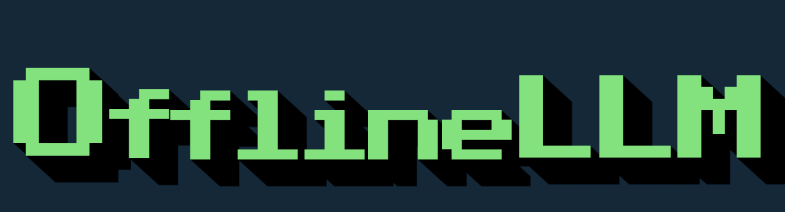
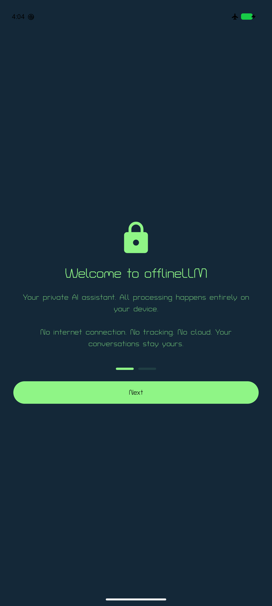
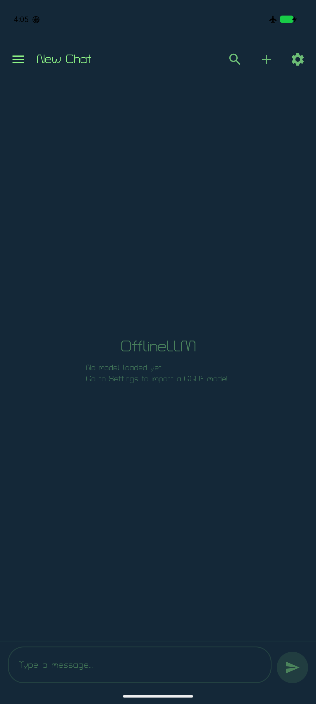
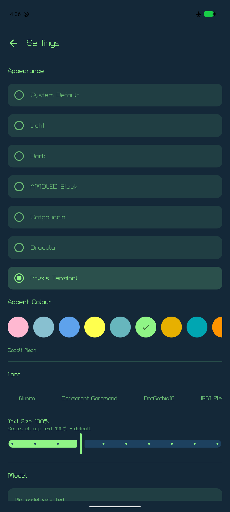
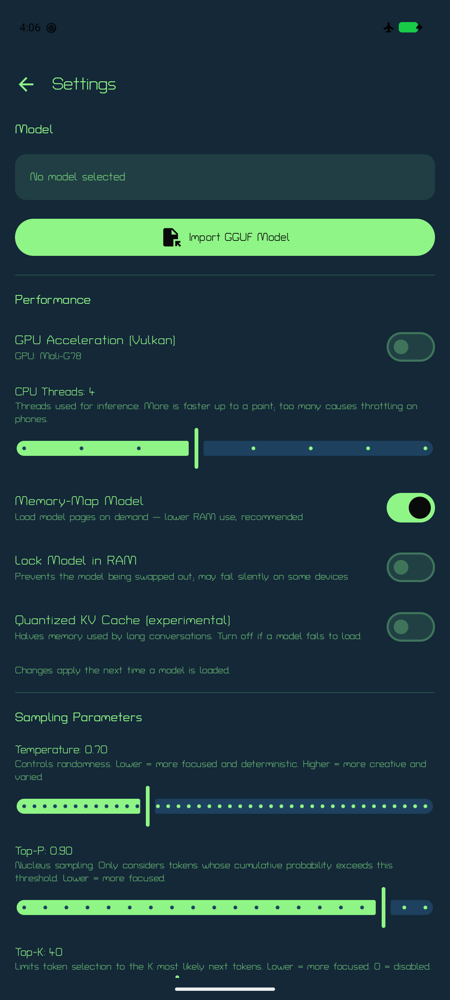
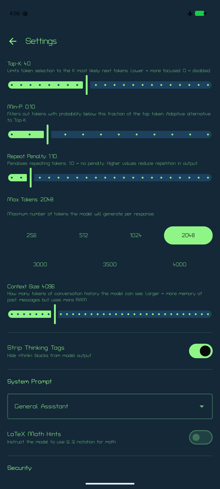
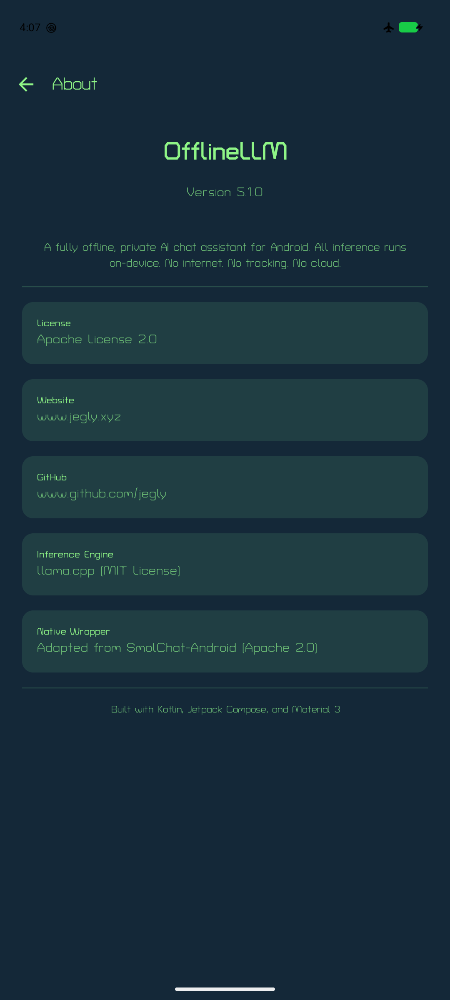

<div align="center">



**The first of its kind — a fully Offline, Private AI chat app for Android**

The only Android LLM app that has 0 Network connectivity. All LLM inference runs on-device via llama.cpp. 

**⚡ Now with GPU acceleration** — opt-in Vulkan offload runs the entire model on your phone's GPU, with per-device CPU kernel dispatch when you stay on CPU.

[](https://kotlinlang.org)
[](https://developer.android.com)
[](https://github.com/jegly/OfflineLLM/releases)
[](LICENSE)
[](https://github.com/ggerganov/llama.cpp)
[]()
[]()
[](https://developer.android.com/jetpack/compose)

[](https://huggingface.co/jegly)

[](https://github.com/jegly/OfflineLLM/releases/latest)

<a href="https://www.buymeacoffee.com/jegly">
  
</a>

</div>

If this project helped you, please ⭐️ star it. **Also try [Box](https://github.com/jegly/Box)** — The most advanced local AI suite on Android today! 

<details>
<summary><b>📱 Screenshots</b></summary>

<p align="center">



</p>

<p align="center">



</p>

</details>

## Features

- **100% Offline** — no INTERNET permission in the manifest, cannot phone home
- **On-Device Inference** — GGUF models via llama.cpp; runtime CPU dispatch picks the best kernel set (dotprod / fp16 / i8mm / SVE) for your exact SoC
- **GPU Acceleration (Vulkan)** — opt-in toggle in Settings with per-layer offload control and automatic CPU fallback; detects and names your GPU
- **Fast Multi-Turn Chat** — incremental prompt processing: each turn feeds only the new message into the KV cache instead of re-processing the whole conversation
- **Performance Controls** — CPU thread count, prompt-phase threading across all cores, memory-mapped loading, RAM lock, experimental quantized KV cache
- **Streaming Responses** — token-by-token output as the model generates
- **Import Any Model** — bring your own GGUF at runtime via file picker
- **Multiple Conversations** — auto-titled, renameable, searchable
- **Translator** — 75+ languages
- **Advanced Sampling** — Temperature, Top-P, Top-K, Min-P, Repeat Penalty
- **System Prompts** — General, Coder, Creative Writer, Tutor, Translator
- **Markdown + TTS** — formatted responses, read aloud via system TTS
- **Thinking Tag Stripping** — hides `<think>` blocks from reasoning models
- **Theming** — 11 Ptyxis terminal palettes (Cobalt Neon default) + Catppuccin (all 4 flavors × 14 accents) + Dracula (7 accents) + System / Light / Dark / AMOLED with Material You accents, plus monochrome-accent mode
- **13 Bundled Fonts** — from Turret Road (default) to IBM Plex, Playfair Display, and Press Start 2P, with an app-wide text-size slider
- **Context Bar** — live token-usage indicator on the chat screen
- **Tamper Detection** — release builds verify the APK signing certificate at startup and refuse to run if repackaged
- **Security** — encrypted settings, optional biometric lock, secure file deletion
- **Chat Backup** — export/import as JSON
- **Gemma 4** — native chat-template support, including the elastic E2B/E4B models with shared-KV layers
- **Actionable Errors** — model-load failures surface the real llama.cpp reason instead of a generic message
- **Backend Diagnostics** — Settings → Performance shows which ggml backend and CPU kernel variant your device actually selected, with its feature flags (DOTPROD / MATMUL_INT8 / SVE / SME); selectable text, so it can be pasted straight into a bug report

## Install

v5.1.1 ships as a single **Vanilla** APK — bring your own GGUF model and import it from Settings.

> **Requires Android 13+ and arm64-v8a.** Vast majority of Android devices since 2019 are arm64.

1. Download from [Releases](https://github.com/jegly/OfflineLLM/releases)
2. **Settings → Apps → Install unknown apps** → allow your file manager
3. Open the APK, tap Install, complete onboarding
4. Settings → Model → **Import GGUF Model** (download one from [HuggingFace](https://huggingface.co))

Or via ADB:

```bash
adb install OfflineLLM_V5.1.1_Signed_Release_Vanilla.apk
```

**Tamper detection:** release builds verify the APK signing certificate at launch. The app exits with an "Unverified App" dialog if anyone has re-signed the APK with a different key.

## Performance

- **CPU**: the APK bundles seven `ggml-cpu` kernel variants (armv8.0 → armv9.2); at load time ggml scores them against your CPU's features and loads the fastest one. Prompt processing additionally uses every core, while generation sticks to the big cores.
- **GPU**: Settings → Performance → *GPU Acceleration (Vulkan)*. Biggest wins on Adreno-class GPUs and anything with cooperative-matrix support; Mali midrange may tie the CPU. If a GPU load fails, the app automatically retries on CPU. Note that on many mobile GPUs — Mali especially — token generation is memory-bandwidth-bound and the CPU kernels can be *faster*; if the GPU toggle feels slower, it probably is, so turn it back off.
- **Long chats**: turn 2 onward only processes your new message — no more re-crunching the whole conversation each turn.
- **Threading**: ggml's own thread pool is used rather than OpenMP, which is what makes the CPU-thread settings actually take effect and keeps generation off the efficiency cores (upstream's Android build does the same).
- **Check what you actually got**: Settings → Performance → *Active backend* lists the selected backend and its feature flags. `DOTPROD` plus `MATMUL_INT8` means the fast quantized-matmul kernels are running; a device showing only `NEON` fell back to the armv8.0 baseline and will be several times slower.
- All performance settings apply the next time a model is loaded.

## Recommended Models

| Model (Q4_K_M) | Approx. Size | RAM Required / Best For |
| :--- | :--- | :--- |
| **gemma-3-270m-it-qat-Q4_K_M.gguf** | ~300 MB | 2–4 GB RAM devices, fast responses |
| **Qwen3.5 0.8B Q4_K_M** | ~530 MB | Good balance for 4–6 GB RAM |
| **gemma-4-E2B-it-GGUF** (2.3B effective) | ~1.3 GB | **Recommended for 6–8 GB RAM** |
| **gemma-4-E4B-it-GGUF** (4.5B effective) | ~2.5 GB | **Recommended for 8 GB RAM** |
| **Qwen3.5/6 2-4B Q4_K_M** | ~2.5 GB | Flagship (12 GB+ RAM) |

Search the model name + "GGUF" on [HuggingFace](https://huggingface.co). `Q4_K_M` is the best quality/speed balance.

## Build from Source

**Prerequisites:** JDK 17, Android SDK (compileSdk 37), NDK 27.2, CMake 3.22.1 or newer (the build picks the newest one installed in the SDK), a host C/C++ compiler (gcc/g++, used to build llama.cpp's Vulkan shader generator)

The Vulkan backend needs two Khronos header repos checked out **inside** the project root. They're gitignored rather than vendored, so clone them after the project:

```bash
git clone --recurse-submodules https://github.com/jegly/OfflineLLM.git
cd OfflineLLM

# Khronos headers for the Vulkan GPU backend (inside the project root).
# Vulkan-Headers is pinned to the tag ggml-vulkan is known to build against.
git clone --branch v1.4.351 --depth 1 https://github.com/KhronosGroup/Vulkan-Headers.git
git clone https://github.com/KhronosGroup/SPIRV-Headers.git
cmake -S SPIRV-Headers -B SPIRV-Headers/build -DCMAKE_INSTALL_PREFIX=SPIRV-Headers/install
cmake --install SPIRV-Headers/build

# Optional: bundle a model in the APK
cp /path/to/model.gguf app/src/main/assets/model/

./gradlew assembleDebug
```

First build compiles llama.cpp from source, including ~1,400 Vulkan compute shaders and seven CPU-variant libraries (~20–30 min). Subsequent builds are fast.

<details>
<summary><b>Project structure</b></summary>

- **`smollm/`** — Native llama.cpp JNI module
  - `src/main/cpp/` — C++ inference engine + JNI bridge
  - `src/main/java/` — SmolLM.kt, GGUFReader.kt wrappers
- **`app/`** — Main Android application (`src/main/java/com/jegly/offlineLLM/`)
  - `ai/` — InferenceEngine, ModelManager, SystemPrompts
  - `data/` — Room database, DAOs, repositories
  - `di/` — Hilt dependency injection modules
  - `ui/` — Compose screens, components, theme, navigation
  - `utils/` — BiometricHelper, MemoryMonitor, SecurityUtils, TTS
- **`llama.cpp/`** — git submodule

</details>

## Security & Privacy

- Zero network permissions (no INTERNET, no ACCESS_NETWORK_STATE)
- No Google Play Services or Firebase dependencies
- Encrypted settings via Jetpack Security
- Optional biometric lock
- Memory Tagging Extension enabled (`memtagMode="sync"`)
- Secure deletion — files overwritten before removal
- No logging of prompts or responses

## License

Apache License 2.0. llama.cpp backend: MIT. Native wrapper adapted from [SmolChat-Android](https://github.com/shubham0204/SmolChat-Android) (Apache 2.0).

---

<div align="center">

**[www.jegly.xyz](https://www.jegly.xyz)**

</div>
